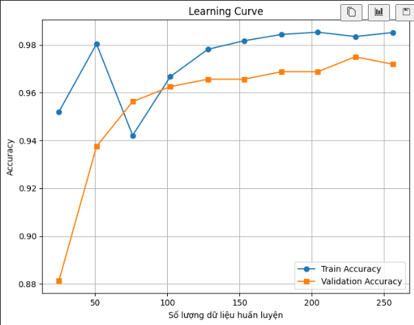
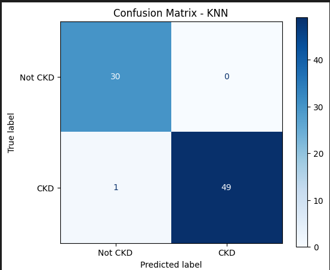

# 🫀 Kidney Disease Prediction (dự đoán bệnh thận)

Dự án Machine Learning (học máy) để dự đoán bệnh thận mạn tính (Chronic Kidney Disease - CKD) bằng các mô hình phân loại.

## 📌 Tổng quan dự án 

**Bối cảnh:** Bệnh thận mạn tính là một "kẻ giết người thầm lặng" với triệu chứng thường không rõ ràng ở giai đoạn đầu. Việc chẩn đoán sớm thông qua các xét nghiệm lâm sàng đóng vai trò sinh tử trong việc điều trị. Với sự phát triển của Trí tuệ nhân tạo, Machine Learning đang trở thành một "trợ lý đắc lực" giúp bác sĩ chẩn đoán nhanh chóng và chính xác hơn.

## 🛠️ Công nghệ sử dụng 

* **Ngôn ngữ lõi:** Python 
* **Machine Learning:** Scikit-learn 
* **Xử lý Dữ liệu:** Pandas, NumPy
* **Cân bằng dữ liệu:** Imbalanced-learn 
* **Trực quan hóa:** Matplotlib, Seaborn
* **Giao diện Web:** Flask
* **Đóng gói mô hình:** Joblib
* **Tiện ích hệ thống:** os
* **Đếm tần suất:** collections.Counter

## 💻 Cách cài đặt
### Clone dự án về máy```

bash

git clone https://github.com/your-username/Kidney-Disease-Prediction.

cd Kidney-Disease-Prediction

## 🚀 Cách chạy dự án
Để mở giao diện web nhập thông số bệnh nhân và xem kết quả dự đoán:
python app/web.py

## 📊 Bộ dữ liệu (Dataset)
Dự án sử dụng bộ dữ liệu
Chronic Kidney Disease
được chia sẻ công khai trên Kaggle.
Dữ liệu bao gồm các chỉ số xét nghiệm lâm sàng, sinh hóa và thông tin nhân khẩu học của bệnh nhân, phục vụ trực tiếp cho việc chẩn đoán bệnh thận mạn tính.

## 📌 Thông tin tổng quan

Kích thước ban đầu: 400 mẫu bệnh án × 25 thuộc tính.

Đặc trưng (feature) đầu vào: 24 thuộc tính y khoa.

Biến mục tiêu: classification.

## 🧾 Biến mục tiêu

1 → CKD (Có bệnh thận mạn tính)

0 → Not CKD (Không mắc bệnh)

## 🔬 Các nhóm đặc trưng
Biến số học (Numeric) 

Age

Blood Pressure

Blood Glucose Random

Blood Urea

Serum Creatinine

Sodium

Potassium

Hemoglobin

Packed Cell Volume

White Blood Cell Count

Red Blood Cell Count

Biến phân loại (Categorical)

Specific Gravity

Albumin

Sugar

Red Blood Cells

Pus Cell

Bacteria

Hypertension

Diabetes Mellitus

Coronary Artery Disease

Appetite

Pedal Edema

Anemia

## 🏆 Đánh giá và Kết quả

### 1. Bảng so sánh hiệu năng các thuật toán

| Thuật toán | Accuracy (Độ chính xác) |
| :--- | :---: |
| **KNN** | **98.75%** |
| Naive Bayes | 97.50% |
| Decision Tree | 96.25% |

**Nhận xét:** 
Thuật toán **KNN (K-Nearest Neighbors)** đã vượt qua các đối thủ để đạt mức độ chính xác cao nhất (98.75%). KNN đặc biệt phát huy sức mạnh trên bộ dữ liệu này bởi vì toàn bộ các đặc trưng y tế (huyết áp, đường huyết,...) đã được chúng ta xử lý nhiễu (Outliers) và đưa về cùng một hệ quy chiếu bằng `MinMaxScaler`. Điều này giúp việc đo lường khoảng cách giữa các bệnh án trở nên cực kỳ chuẩn xác. Do đó, KNN được lựa chọn làm mô hình lõi của hệ thống.

---

### 2. Kết quả đánh giá chuyên sâu trên tập Test

Dữ liệu kiểm thử (Test set) là tập dữ liệu hoàn toàn mới, được giấu kín trong suốt quá trình huấn luyện để đánh giá năng lực thực tế của mô hình:

* **Accuracy (Độ chính xác tổng thể):** 99%
* **Recall (Độ nhạy đối với nhãn CKD):** 98%
* **Precision (Độ chuẩn xác):** 97%

**Nhận xét chỉ số y tế:** 
Kết quả đạt được là vô cùng ấn tượng. Trong y tế, chỉ số quan trọng nhất là **Recall (98%)**, điều này đồng nghĩa với việc hệ thống có khả năng nhận diện đúng 98% số bệnh nhân thực sự mắc bệnh thận, nguy cơ bỏ sót bệnh nhân (False Negative) là cực kỳ thấp. Đồng thời, **Precision đạt 97%** cho thấy khi hệ thống cảnh báo "Có bệnh", độ tin cậy là rất cao, tránh gây hoang mang cho người khỏe mạnh.

---

### 3. Trực quan hóa kết quả (Visualizations)

#### A. Biểu đồ học tập (Learning Curve)


**Nhận xét:** 
Biểu đồ cho thấy đường Train Accuracy (màu xanh) và Validation Accuracy (màu cam) có xu hướng bám sát nhau và cùng hội tụ ở mức điểm rất cao (>96%) khi lượng dữ liệu huấn luyện tăng lên. Khoảng cách giữa hai đường rất hẹp, minh chứng rõ ràng cho việc mô hình học được quy luật thực sự của dữ liệu, **hoàn toàn không xảy ra hiện tượng Overfitting (Quá khớp)**.

#### B. Ma trận nhầm lẫn (Confusion Matrix)


**Nhận xét:** 
Ma trận nhầm lẫn phản ánh trực quan sự xuất sắc của thuật toán KNN trên tập Test:
* **Nhóm người khỏe mạnh (Not CKD):** Mô hình chẩn đoán đúng tuyệt đối 30/30 ca, không có bất kỳ ca báo động giả nào (0 False Positive).
* **Nhóm người mắc bệnh thận (CKD):** Trong số 50 ca bệnh thực tế, mô hình đã bắt đúng 49 ca, và chỉ phân loại nhầm duy nhất 1 ca thành khỏe mạnh (1 False Negative). 
Đây là một tỷ lệ sai số cực kỳ thấp, đáp ứng xuất sắc yêu cầu khắt khe của một hệ thống chẩn đoán y khoa sơ bộ.

## 🎬 Demo giao diện 

Demo 1: Dự đoán dữ liệu mắc bệnh thận (CKD)
.png) 
Demo 2: Dự đoán dữ liệu không mắc bệnh thận (Normal)
.png) 

## 📋 Tổng Quan Quy Trình

Toàn bộ quy trình từ lúc nạp dữ liệu thô đến khi xuất xưởng mô hình được tổ chức thành một luồng (pipeline) liền mạch, chia làm 2 giai đoạn chính:

### 🔍 Giai Đoạn 1: Tiền Xử Lý & Khám Phá Dữ Liệu (Data Preprocessing & EDA)

### 1.1 Làm Sạch Dữ Liệu (Data Cleaning)
- Chuẩn hóa tên cột
- Loại bỏ các ký tự rác đặc thù của bộ dữ liệu y tế (như `?`, `\t`)
- Đồng bộ kiểu dữ liệu

### 1.2 Xử Lý Dữ Liệu Khuyết Thiếu (Missing Values)
- Điền khuyết bằng phương pháp **Trung vị (Median)** cho các biến số học 
- Điền khuyết bằng phương pháp **Yếu vị (Mode)** cho các biến phân loại 

### 1.3 Xử Lý Ngoại Lai (Outliers Handling)
- Áp dụng kỹ thuật chặn trên/dưới bằng khoảng tứ phân vị (IQR Capping)
- Giảm thiểu nhiễu mà không làm mất dữ liệu bệnh án

### 1.4 Mã Hóa (Encoding)
- Chuyển đổi toàn bộ các biến phân loại dạng Text (như Yes/No, Normal/Abnormal,...) sang định dạng nhị phân (0/1)

### 1.5 Khám Phá Dữ Liệu (EDA)
- Trực quan hóa phân phối
- Vẽ bảng tần số chéo
- Ma trận tương quan (Correlation Heatmap)
- Trích xuất các đặc trưng y tế quan trọng nhất (ví dụ: Hemoglobin, Serum Creatinine,...)

## 🤖 Giai Đoạn 2: Huấn Luyện & Đánh Giá Mô Hình (Model Building & Evaluation)

### 2.1 Phân Chia Dữ Liệu (Data Splitting)
- Chia tập Train/Test theo tỷ lệ **80/20**
- Sử dụng tham số `stratify` để duy trì tỷ lệ phân bố nhãn bệnh lý

### 2.2 Chuẩn Hóa (Scaling)
- Áp dụng `MinMaxScaler` để đưa toàn bộ hệ số về thang đo **[0, 1]**

### 2.3 Cân Bằng Dữ Liệu (Oversampling)
- Nhận diện vấn đề mất cân bằng nhóm bệnh nhân
- Áp dụng kỹ thuật sinh mẫu nhân tạo **SMOTE** độc lập trên tập Train
- Giúp mô hình học các đặc trưng của nhóm thiểu số tốt hơn

### 2.4 Huấn Luyện & So Sánh
Thử nghiệm đồng loạt **3 thuật toán học máy**:

1. **Decision Tree (Cây quyết định)**
2. **K-Nearest Neighbors (KNN)**
3. **Gaussian Naive Bayes**

### 2.5 Đánh Giá Chuyên Sâu
Mô hình chiến thắng được phân tích chi tiết thông qua các thước đo y tế khắt khe:

- **Báo cáo phân loại**
- **Ma trận nhầm lẫn**
- **Biểu đồ học tập** kiểm tra Overfitting bằng Cross-Validation (cv=5)

## 👨‍💻 Tác giả (Author)

Nguyễn Ngọc Tuấn Anh

Chuyên ngành: Hệ thống Thông tin 

Trường Đại học Thủy lợi (TLU) 

## 📫 Liên hệ
Email: ngoctuananh09@gmail.com


